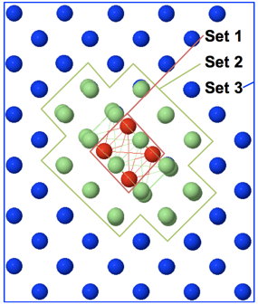

.. _core_concetps:

Core Concepts
#############

Overview and General Workflow
-----------------------------

StructOpt uses a Genetic Algorithm to optimize a set of atomic structures according to a customizable objective function (aka cost function).

Genetic Algorithm
=================

A genetic algorithm utilizes a population of structures rather than a single individual. A genetic algorithm, or evolutionary algorithm, is conceptually similar to genetic Darwinism where animals are replaced by "individuals" (in the case of StructOpt a "individual" is an atomic model). A population of atomic models is first generated. Given a population, pairs of individuals are mated (aka crossed over) by selecting different aspects of each model and pasting them into each other. Crossovers always produce two children, one for each section of the models combined together. The offspring are added to the population. After the mating scheme has finished, single individuals can "mutate" (i.e. moving atoms in a unique way) to add new genes to the population's gene pool. After the atoms have been moved via crossovers and mutations, the structures are relaxed. Finally, each structure is run though a series of "fitness" evaluations to determine how "fit to survive" it is, and the population is then reduced to its original size based on a number of optional selection criteria. This process is repeated many times.

In summary:

1. Generate initial structures
2. Locally relax structures
3. Calculate fitness values (e.g. energies) of each structure
4. Remove some individuals from the population based on their fitness value
5. Perform crossovers and selected individuals to generate offspring for the next generation
6. Perform mutations on the selected individuals in the current population and offspring for the next generation
7. Repeat steps 2-6 until the convergence criteria are met

The relaxation and fitness evaluations are only performed on individuals that have been modified via crossovers and mutations. This avoids recomputing these expensive calculations for individuals that were unchanged during the generation's crossover/mutation scheme.

During crossovers, the offspring are collected into a list. After all crossovers have been completed, these offspring are added to the entire population. Each individual in the entire population then has a chance to be mutated. There will therefore be a variable number of modified individuals that will need to be relaxed and fit during each generation. The number of modified individuals can only be predicted by using the probability of mutation and crossover.

Cost Function
-------------

Individual
----------

Structure Types
===============

Crystal
"""""""
Implemented by default.

Has periodic boundary conditions along all dimensions. The entire model is relaxed.

Cluster
"""""""
Not implemented.

Does not have periodic boundary conditions. The entire model is relaxed.

Defect
""""""
Not implemented.

There are three layers to this structure type. The outer layer contains the fixed atoms that are never moved but are used as constrains in the relaxations and fitnesses. The middle layer contains atoms that are part of the crystal structure but that will be mutated, crossed-over, and relaxed. The inner layer contains the defect and it will also be mutated cross-over, and relaxed.

Surface
"""""""
Not implemented.

Population
----------

Crossovers
----------

Crossover Selection Schemes
---------------------------

Mutations
---------

Predators and Predator Selection Schemes
----------------------------------------

`Roulette Wheel Selection <https://en.wikipedia.org/wiki/Fitness_proportionate_selection>`_

Fingerprinters
--------------

Relaxations
-----------

Fitnesses
---------

Relevant References
-------------------

* Crystals: Artem Oganov, Alex Zunger, Scott Woodley, Richard Catlow
* Clusters: Roy L. Johnston, Bernd Hartke, David Deaven
* Surfaces: Cristian V. Ciobanu, Kai-Ming Ho

